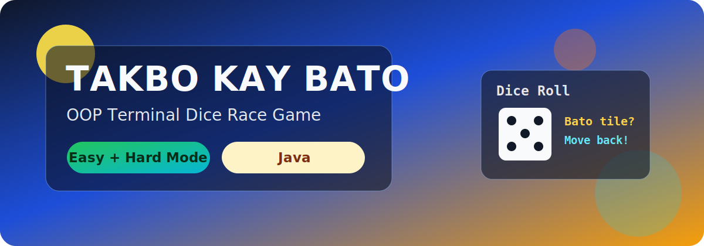

# Takbo Kay Bato



Takbo Kay Bato is a terminal-based Java board-race game. Two players race to the finish line by rolling a six-sided die.

- Modes: Player vs Computer or Player vs Player
- Board levels:
  - Easy Mode: 38 spaces
  - Hard Mode: 65 spaces
- Match format: First to the selected winning score (1 to 5)

## What Is This Game?

This is a turn-based race game with a twist:

- Each turn, a player rolls a die and moves forward.
- If a player lands on a Bato (police) tile, Bato rolls a die and pushes that player backward by the rolled value.
- Reaching the finish line gives 1 point.
- After a point is scored, positions reset and the next round starts.
- The first player to reach the target score wins the match.

## How To Play

1. Run the game.
2. Resize your terminal when prompted, then press Enter.
3. Select game mode:
   - [1] Player vs Computer
   - [2] Player vs Player
4. Select board level:
   - [1] Easy
   - [2] Hard
5. Select winning score (1 to 5).
6. Choose Player 1 color.
7. Choose Player 2 color (or the computer gets a random different color).
8. During turns, press Enter to roll and move.
9. Watch out for Bato tiles (cyan markers) because they can move you backward.
10. Keep scoring points by reaching the finish line until someone reaches the selected winning score.

## Controls

- Enter: continue prompts and roll on your turn
- Numeric input: choose menu options
- 0 in setup menus: back (or quit from main menu)

## Run Locally

### Requirements

- Java JDK 8 or newer
- `javac` and `java` available in your PATH

### Compile and Run

```bash
javac -encoding UTF-8 *.java
java Launcher
```

## GitHub Quick Start

```bash
git clone <your-repo-url>
cd Game
javac -encoding UTF-8 *.java
java Launcher
```

If `javac` is not recognized, install a JDK and restart your terminal.
